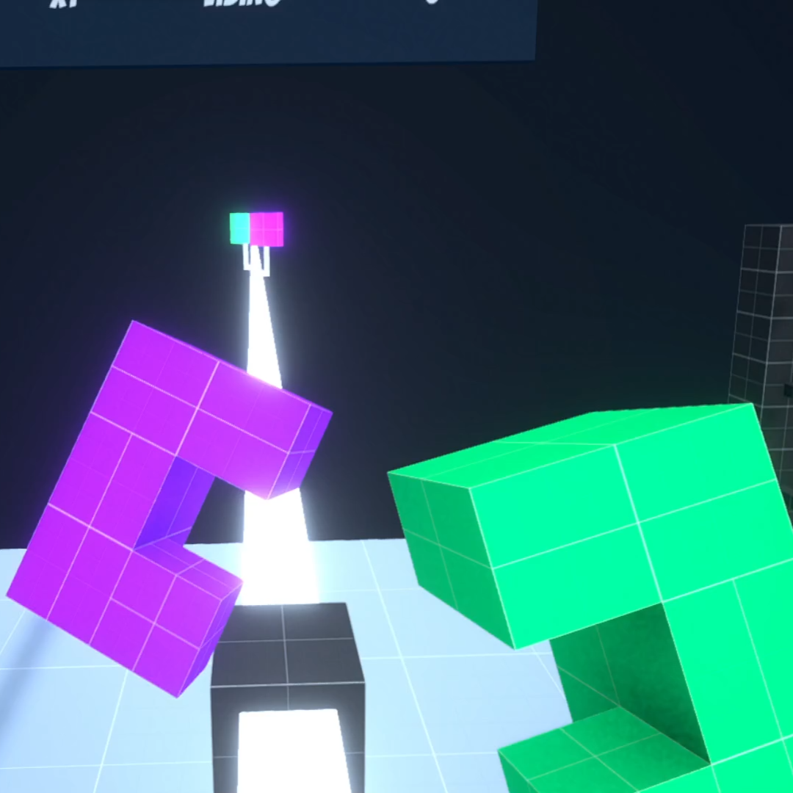
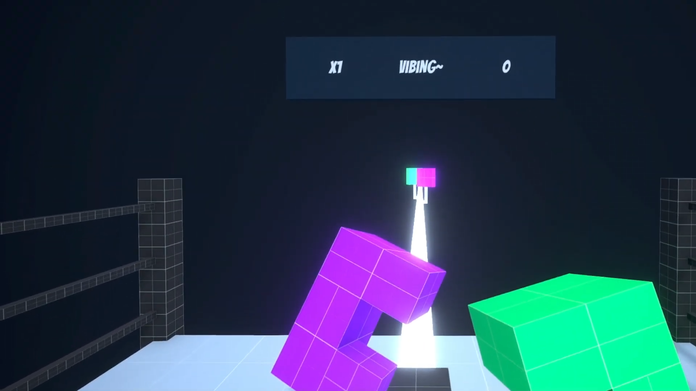
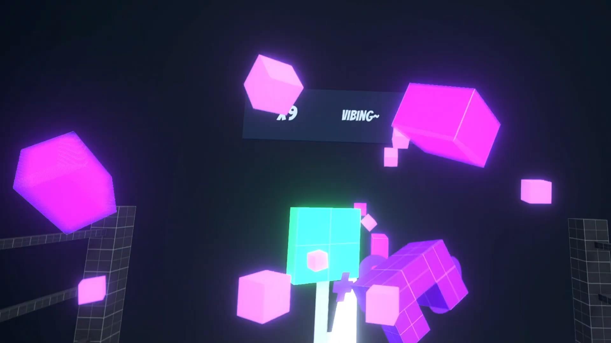
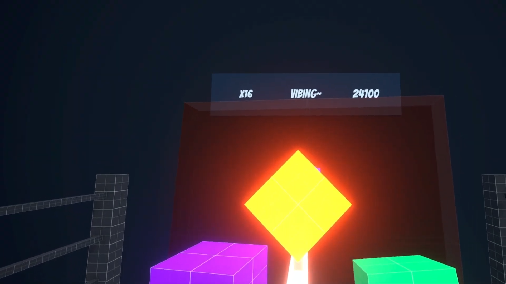

# Musical Boxing

Virtual Reality boxing term project for CPS 643

## About

This is a final term project built for Toronto Metropolitan University's Virtual Reality course (CPS 643).

The game was made using Unity version 2023.2.12f so I recommend using this or a newer version to open it. A playable version can be downloaded [in the release section](https://github.com/ThaiDuongVu/ProjectBoxing/releases). I recommend playing with the Meta Quest 2 headset.

## Project Presentation

A project presentation website can be accessed [here](https://thaiduongvu.github.io/cps643-project-presentation/).

## Project Description

**Musical Boxing** is a Virtual Reality video game where the player plays as a boxing trainee trying to hit, block or dodge incoming targets/obstacles to the beat of a song. The player can perform these boxing moves using the VR controllers that simulate boxing gloves in the virtual environment. The player earns points for each successful hit on the beat. Multiple successful hits in a row increase a combo meter that earns the player more points.

## Screenshots

